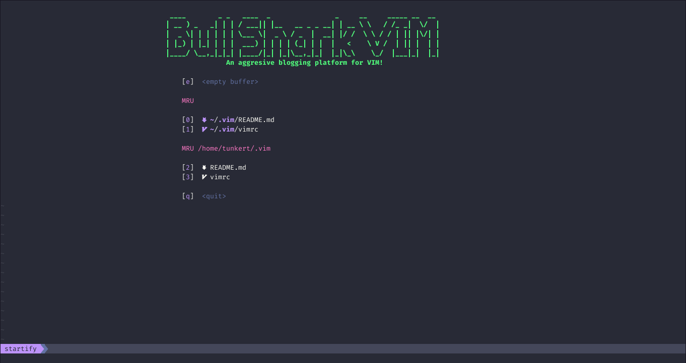
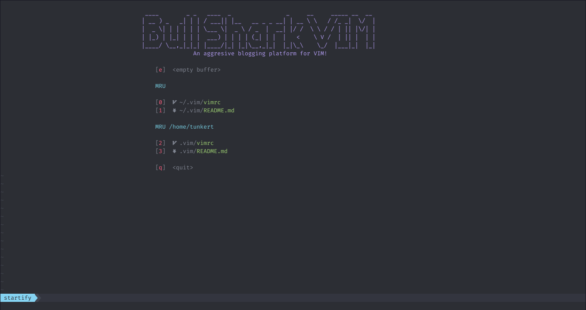

# Welcome to Bullshark VIM

Disclaimer: install at your own risk. THERE IS NO WARRANTY WHATSOEVER.

## Table of Contents

1. <a href="#requirements">Requirements</a>
2. <a href="#installation">Installation</a>
3. <a href="#screenshots">Screenshots</a>

<h2 id="requirements">Requirements</h2>

You'll need to install a Nerd Font from [Nerd Fonts](https://github.com/ryanoasis/nerd-fonts) and set your terminal to view the Nerd Font. Here is a video on how to do that with the Kitty terminal:

[https://www.youtube.com/embed/4KdAqsU7E-M](https://www.youtube.com/embed/4KdAqsU7E-M "YouTube video on setting up Devicons in VIM")

<h2 id="installation">Installation</h2>

To install Bullshark VIM clone this repository into your .vim folder, make sure to remove the .vim folder prior and backup. You can then paste this command into your terminal:

```
git clone https://github.com/Tunkert/Bull-Shark-VIM ~/.vim
```

<h2 id="screenshots">Screenshots</h2>

### Bull Shark VIM with Dracula Theme



### Bull Shark VIM with Sonokai Theme (default)


